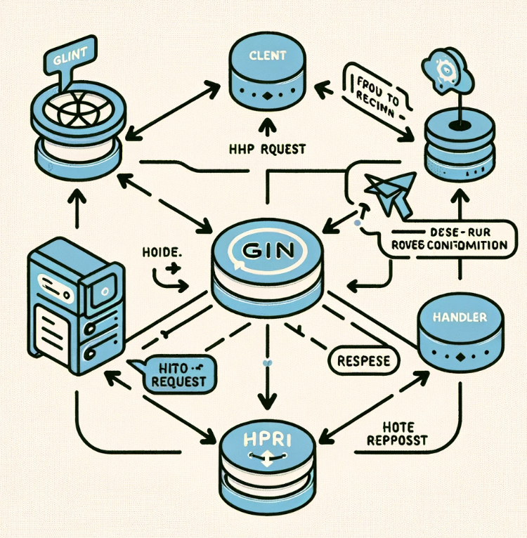
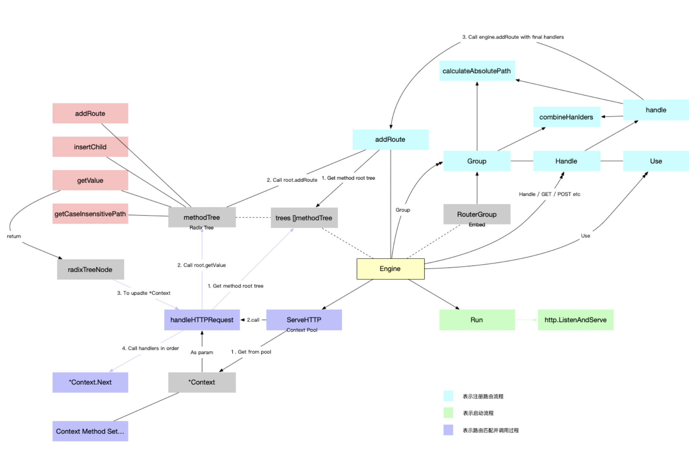
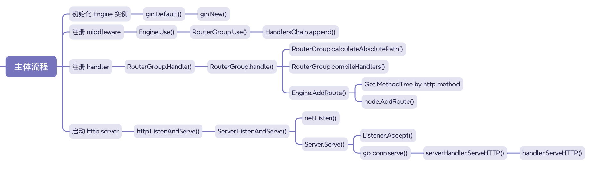
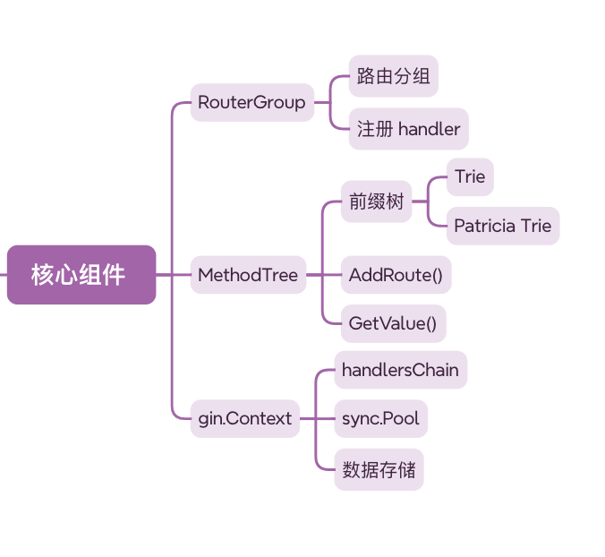
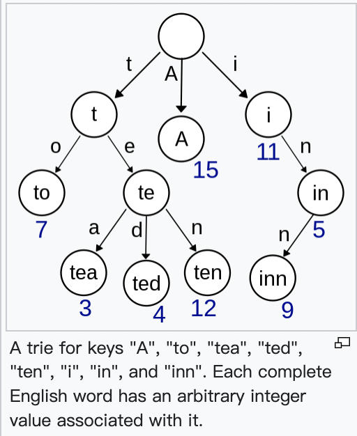
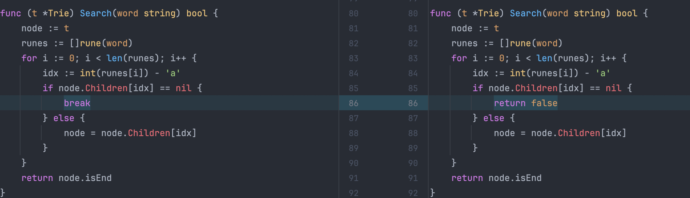
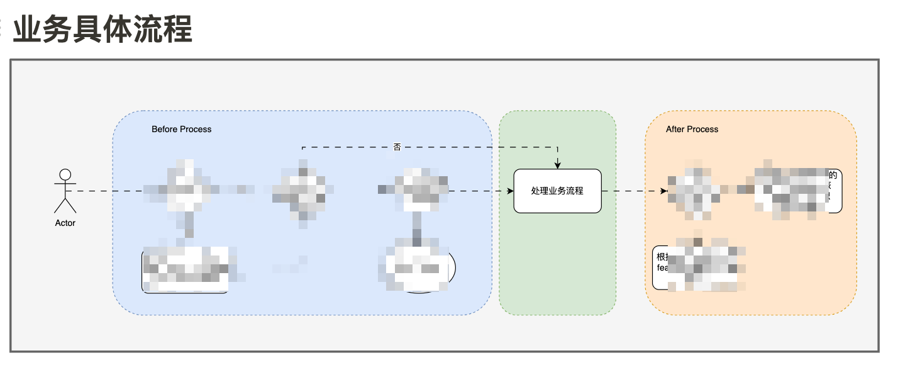

# 介绍

## 什么是 gin ？

一个轻量级高性能 HTTP Web 框架。

> [Introduction | Gin Web Framework (gin-gonic.com)](https://gin-gonic.com/docs/introduction/)
> Gin 是一个用 Go (Golang) 编写的 HTTP Web 框架。 它具有类似 Martini 的 API，但性能比 Martini 快 40 倍。


## 为什么使用 gin ？

> [Introduction | Gin Web Framework (gin-gonic.com)](https://gin-gonic.com/docs/introduction/)
>
> - Zero allocation router
> - Fast
> - Middleware support
> - Crash-free
> - JSON validation
> - Routes grouping
> - Error management
> - Rendering built-in
> - Extendable

# Quickstart

1. 构造默认配置的 gin.Engine
2. 注册中间件
3. 注册方法
4. 启动 http server

```go
func testMiddle(c *gin.Context) {
	fmt.Println("middle test")
}

func main() {
	// 构造默认配置的 gin.Engine
	engine := gin.Default()
	// 注册中间件
	engine.Use(testMiddle)
	// 注册方法
	engine.Handle("GET", "/test", func(c *gin.Context) {
		fmt.Println("route test")
	})
	// 启动 http server
	if err := engine.Run(); err != nil {
		fmt.Println(err)
	}
}
```

# gin 源码模块

| 位置           | 功能                              |
| -------------- | --------------------------------- |
| gin.go         | 核心结构体 Engine，整个服务的入口 |
| context.go     | 请求上下文                        |
| tree.go        | 方法树，底层是压缩前缀树          |
| routergroup.go | 路由组                            |

>为了方便大家阅读，实现了一个非常简易版的 gin
>https://github.com/ddl-killer/gin-read/tree/main/simplified_gin/lorgin


# gin 与 net/http

gin 是对 net/http 做了一层包装，使其更加简单易用

## 为什么不用 net/http?

在有 net/http 的情况下，是否有任何真正令人信服的理由来引入像 gin 这样的外部依赖

在 go 版本更新 1.22 之前，可能可以有如下理由：

- 需要支持基于方法的路由
- 需要支持 url 路径中的变量
- 需要支持基于主机的路由选择
- 需要支持 regexp 路由模式
- 需要构建一个大量使用中间件的 web 程序

之前由于 net/http 包的路由注册能力较为原生，以致于诞生了不少第三方库以增强路由注册能力，但在这个月底刚更新的 go1.22 里增强了路由注册能力，支持了可选方法，设置路径变量和基于主机的路由注册。

"我应该使用哪个路由器软件包？"是 Go 程序初学者的常见问题。在 Go 1.22 发布后，这个问题的常见答案会有所改变，因为许多人会发现标准库足以满足他们的需求，而无需求助于第三方软件包。

但是 gin 这样的轻量级框架，它不仅提供了路由器，还提供了用于构建 Web 后端的额外工具, 比如更便捷的中间件注册，错误处理和模板渲染。


> 由 log/slog 的作者 Jonathan Amsterdam 创建的提案
>  https://github.com/golang/go/issues/61410


> https://tip.golang.org/doc/go1.22#enhanced_routing_patterns
>
> ### Enhanced routing patterns
>
> HTTP routing in the standard library is now more expressive. The patterns used by [`net/http.ServeMux`](https://tip.golang.org/pkg/net/http#ServeMux) have been enhanced to accept methods and wildcards.
>
> Registering a handler with a method, like `"POST /items/create"`, restricts invocations of the handler to requests with the given method. A pattern with a method takes precedence over a matching pattern without one. As a special case, registering a handler with `"GET"` also registers it with `"HEAD"`.
>
> Wildcards in patterns, like `/items/{id}`, match segments of the URL path. The actual segment value may be accessed by calling the [`Request.PathValue`](https://tip.golang.org/pkg/net/http#Request.PathValue) method. A wildcard ending in "...", like `/files/{path...}`, must occur at the end of a pattern and matches all the remaining segments.
>
> A pattern that ends in "/" matches all paths that have it as a prefix, as always. To match the exact pattern including the trailing slash, end it with `{$}`, as in `/exact/match/{$}`.
>
> If two patterns overlap in the requests that they match, then the more specific pattern takes precedence. If neither is more specific, the patterns conflict. This rule generalizes the original precedence rules and maintains the property that the order in which patterns are registered does not matter.
>
> This change breaks backwards compatibility in small ways, some obvious—patterns with "{" and "}" behave differently— and some less so—treatment of escaped paths has been improved. The change is controlled by a [`GODEBUG`](https://tip.golang.org/doc/godebug) field named `httpmuxgo121`. Set `httpmuxgo121=1` to restore the old behavior.


> https://pkg.go.dev/net/http@go1.22rc1#ServeMux
>
> #### Patterns[¶](https://pkg.go.dev/net/http@go1.22rc1#hdr-Patterns)
>
> Patterns can match the method, host and path of a request. Some examples:
>
> - "/index.html" matches the path "/index.html" for any host and method.
> - "GET /static/" matches a GET request whose path begins with "/static/".
> - "example.com/" matches any request to the host "example.com".
> - "example.com/{$}" matches requests with host "example.com" and path "/".
> - "/b/{bucket}/o/{objectname...}" matches paths whose first segment is "b" and whose third segment is "o". The name "bucket" denotes the second segment and "objectname" denotes the remainder of the path.


## gin 是如何与 net/http 链接起来的呢？

### 处理请求

net/http 中最终会通过调用 ServeHTTP 方法处理请求，所以实现该 Handler 接口即可

```go
type Handler interface {
	ServeHTTP(ResponseWriter, *Request)
}
```

```go
func (c *conn) serve(ctx context.Context) {
  for {
    w, err := c.readRequest(ctx)
    serverHandler{c.server}.ServeHTTP(w, w.req)
    w.finishRequest()
  }
}
```

gin 的核心结构体 Engine 即实现了该接口

```go
// ServeHTTP conforms to the http.Handler interface.
func (engine *Engine) ServeHTTP(w http.ResponseWriter, req *http.Request) {
	engine.handleHTTPRequest(c)
}
```

### 启动服务

通过 Engine.Run()  启动 http server 的背后其实是通过 http.ListenAndServe() 启动

```go
func (engine *Engine) Run(addr ...string) (err error) {
	address := resolveAddress(addr)
	debugPrint("Listening and serving HTTP on %s\n", address)
	err = http.ListenAndServe(address, engine.Handler())
	return
}
```


# Overview



# 主体流程

1. 初始化 Engine 实例
2. 注册 middleware
3. 注册 handler
4. 启动服务





## 初始化 Engine 实例

Default() 除了一些默认的配置之外，其实就是调用 New() 创建 Engine 实例

在 New() 中，将 RouterGroup，trees，和 pool 初始化好

1. RouterGroup 是路由组，负责在服务启动前的辅助注册路由
2. trees 是方法树，底层是一个压缩前缀树 radix，上面的叶子节点挂载的就是 url 及其对应 url 的请求处理函数，处理请求的时候就在方法树上通过请求的 url 查找对应 url 的请求处理函数
3. pool 是 gin.Context 对象池，gin.Context 也是使用 gin 框架中经常会使用到的结构体，会通过 ServeHTTP 函数的参数和注册的路由和中间件构建成请求上下文 gin.Context 


```go
type Engine struct {
	RouterGroup
	// ...
	pool             sync.Pool
	trees            methodTrees
	// ...
}
```

```go
func Default() *Engine {
	// ...
	engine := New()
	// 一些默认配置
	return engine
}
```

```go
func New() *Engine {
	// ...
	engine := &Engine{
		RouterGroup: RouterGroup{
			Handlers: nil,
			basePath: "/",
			root:     true,
		},
        // ...
		trees:                  make(methodTrees, 0, 9),
		// ...
	}
	engine.RouterGroup.engine = engine
	engine.pool.New = func() any {
		return engine.allocateContext(engine.maxParams)
	}
	return engine
}
```


## 注册 middleware

Engine.Use -》RouterGroup.Use 然后将新注册的 middleware 拼接到 handlers 后面

```go
func (engine *Engine) Use(middleware ...HandlerFunc) IRoutes {
	engine.RouterGroup.Use(middleware...)
	return engine
}
```

```go
func (group *RouterGroup) Use(middleware ...HandlerFunc) IRoutes {
	group.Handlers = append(group.Handlers, middleware...)
	return group.returnObj()
}
```

```go
type RouterGroup struct {
	Handlers HandlersChain
	basePath string
	engine   *Engine
	root     bool
}
```

```go
type HandlerFunc func(*Context)

type HandlersChain []HandlerFunc
```


## 注册 handler

1. group.calculateAbsolutePath(relativePath) 返回要注册的路由的绝对路径 absolutePath
2. group.combineHandlers(handlers) 返回要注册的路由的所有 handlers
3. group.engine.addRoute(httpMethod, absolutePath, handlers) 调用 Engine.addRoute() 将路由挂载到方法树上

```go
func (group *RouterGroup) Handle(httpMethod, relativePath string, handlers ...HandlerFunc) IRoutes {
	// ...
	return group.handle(httpMethod, relativePath, handlers)
}
```

```go
func (group *RouterGroup) handle(httpMethod, relativePath string, handlers HandlersChain) IRoutes {
	// 返回要注册的路由的绝对路径 absolutePath
    absolutePath := group.calculateAbsolutePath(relativePath)
    // 返回要注册的路由的所有 handlers
	handlers = group.combineHandlers(handlers)
    // 调用 Engine.addRoute() 将路由挂载到方法树上
	group.engine.addRoute(httpMethod, absolutePath, handlers)
	return group.returnObj()
}
```


### 计算要注册的路由的绝对路径

拼接 routergroup 的 basePath 和注册时的 relativePath 得到路由的绝对路径 absolutePath

```go
func (group *RouterGroup) calculateAbsolutePath(relativePath string) string {
	return joinPaths(group.basePath, relativePath)
}
```

```go
func joinPaths(absolutePath, relativePath string) string {
	if relativePath == "" {
		return absolutePath
	}

	finalPath := path.Join(absolutePath, relativePath)
	if lastChar(relativePath) == '/' && lastChar(finalPath) != '/' {
		return finalPath + "/"
	}
	return finalPath
}
```


### 计算要注册的路由的所有 handlers

拼接 routergroup 已有的 handlers 和注册时的 handlers 得到所有 handlers

这里是深复制

```go
func (group *RouterGroup) combineHandlers(handlers HandlersChain) HandlersChain {
	finalSize := len(group.Handlers) + len(handlers)
	assert1(finalSize < int(abortIndex), "too many handlers")
	mergedHandlers := make(HandlersChain, finalSize)
	copy(mergedHandlers, group.Handlers)
	copy(mergedHandlers[len(group.Handlers):], handlers)
	return mergedHandlers
}
```

### 挂载路由到方法树上

1. 获取对应 method 的方法树
2. 将 path 和对应的 handlers 挂载到该方法树上
3. root.addRoute(path, handlers) 这步就是压缩前缀树添加节点的算法，后面再展开

```go
func (engine *Engine) addRoute(method, path string, handlers HandlersChain) {
	// ...
    // 获取对应 method 的方法树
	root := engine.trees.get(method)
	if root == nil {
		root = new(node)
		root.fullPath = "/"
		engine.trees = append(engine.trees, methodTree{method: method, root: root})
	}
    // 将 path 和对应的 handlers 挂载到该方法树上
	root.addRoute(path, handlers)
	// ...
}
```

## 启动 http server

通过 Engine.Run()  启动 http server 的背后其实是通过 http.ListenAndServe() 启动

```go
func (engine *Engine) Run(addr ...string) (err error) {
	address := resolveAddress(addr)
	debugPrint("Listening and serving HTTP on %s\n", address)
	err = http.ListenAndServe(address, engine.Handler())
	return
}
```




# RouterGroup

## 路由分组

通过 IRouter 接口的 Group(string, ...HandlerFunc) *RouterGroup 方法分出路由组

和注册 handler 的过程异曲同工

1. 获取新路由组的完整路径
2. 获取新路由的所有方法

```go
type IRouter interface {
	IRoutes
	Group(string, ...HandlerFunc) *RouterGroup
}
```


```go
func (group *RouterGroup) Group(relativePath string, handlers ...HandlerFunc) *RouterGroup {
	return &RouterGroup{
		Handlers: group.combineHandlers(handlers),
		basePath: group.calculateAbsolutePath(relativePath),
		engine:   group.engine,
	}
}
```


## 注册 handler

```GO
type IRoutes interface {
	Use(...HandlerFunc) IRoutes

	Handle(string, string, ...HandlerFunc) IRoutes
	Any(string, ...HandlerFunc) IRoutes
	GET(string, ...HandlerFunc) IRoutes
	POST(string, ...HandlerFunc) IRoutes
	DELETE(string, ...HandlerFunc) IRoutes
	PATCH(string, ...HandlerFunc) IRoutes
	PUT(string, ...HandlerFunc) IRoutes
	OPTIONS(string, ...HandlerFunc) IRoutes
	HEAD(string, ...HandlerFunc) IRoutes
	Match([]string, string, ...HandlerFunc) IRoutes

	StaticFile(string, string) IRoutes
	StaticFileFS(string, string, http.FileSystem) IRoutes
	Static(string, string) IRoutes
	StaticFS(string, http.FileSystem) IRoutes
}
```


# MethodTree

方法树的底层是具有优先级的压缩前缀树


## Trie 前缀树

1960 年，爱德华-弗雷德金（Edward Fredkin）创造了 trie 一词，并在检索的中间音节后发音为 [/ˈtriː/](https://en.wikipedia.org/wiki/Help:IPA/English) （如 "tree"）。 不过，其他作者将其发音为 [/ˈtraɪ/](https://en.wikipedia.org/wiki/Help:IPA/English) （如 "try"），试图在口头上将其与 "tree "区分开来。Tries 是字符串索引查找数据结构的一种形式，用于存储单词的字典列表，可以高效地生成补全列表。所以也被称为字典树，但我不喜欢字典树这个发音，因为我对字典的印象是一本扁的书，和树这种立体结构不搭边。

通过下图可以看出，前缀树的关键点就是每一个节点的所有的子节点都拥有相同的前缀。

对于 trie 的应用场景主要就是一次建树，多次查找

插入时间复杂度：O(n)

查找时间复杂度：O(n)

### 路由注册也可以使用 hashmap，为什么用前缀树？

1. 动态路由：网络框架通常需要支持动态路由，在这种情况下，路径可以有不同的段。例如， `/users/:userid` 。hashmap 对于静态路由很有效，但并不支持这种模式匹配。


## Patricia Trie / Radix 压缩前缀树

压缩前缀树是一种优化过的树结构，用于高效地存储和检索具有共享前缀的字符串。在这种树中，每个节点可以包含多个字符，从而减少树的深度并提高效率。

### 为什么用压缩前缀树？

1. 减少树的深度并提高查找效率
2. 因为减少树的深度同时也能减少内存占用



> PATRICIA--检索字母数字编码信息的实用算法
> https://dl.acm.org/doi/pdf/10.1145/321479.321481
>
> 出版日期：1968 年 10 月 01 日


## 具有优先级的 Patricia Trie

因为前缀树的查找是一个从左到右深度遍历树的过程，所以如果一个被查找概率大的节点但排在最右边，就会增加查找的耗时。

因此会增加特定子节点的优先级，并在必要时重新排序。这对于处理具有相同前缀但不同优先级的路由至关重要。


```go
func (n *node) incrementChildPrio(pos int) int {
    cs := n.children
    cs[pos].priority++
    prio := cs[pos].priority

    // Adjust position (move to front)
    newPos := pos
    for ; newPos > 0 && cs[newPos-1].priority < prio; newPos-- {
        // Swap node positions
        cs[newPos-1], cs[newPos] = cs[newPos], cs[newPos-1]
    }

    // Build new index char string
    if newPos != pos {
        n.indices = n.indices[:newPos] + // Unchanged prefix, might be empty
            n.indices[pos:pos+1] + // The index char we move
            n.indices[newPos:pos] + n.indices[pos+1:] // Rest without char at 'pos'
    }

    return newPos
}
```


## Merkle Patricia Trie 默克尔压缩前缀树

虽然都是树形数据结构，但它们的设计目的和特性有显著的不同

Gin 框架中的 radix 主要用于高效的路由匹配。它通过共享公共前缀来组织路由，优化了路径的搜索和匹配过程。

以太坊中的MPT主要用于确保数据的完整性和一致性。根节点成为整个数据结构的加密指纹。它是一种加密的数据结构，用于验证区块链中的数据没有被篡改。专注于确保区块链数据的安全和一致性。


## 实现 Trie

```go
type Trie struct {
	Children [26]*Trie
	isEnd    bool
}

func Constructor() Trie {
	return Trie{}
}
```

### 插入

描述：向 Trie 中插入一个单词 word

实现：这个操作和构建链表很像。首先从根结点的子结点开始与 word 第一个字符进行匹配，一直匹配到前缀链上没有对应的字符，这时开始不断开辟新的结点，直到插入完 word 的最后一个字符，同时还要将最后一个结点isEnd = true;，表示它是一个单词的末尾。

```go
func (t *Trie) Insert(word string) {
	node := t
	runes := []rune(word)
	for i := 0; i < len(runes); i++ {
		idx := int(runes[i]) - 'a'
		if node.Children[idx] == nil {
			child := Constructor()
			node.Children[idx] = &child
			node = &child
		} else {
			node = node.Children[idx]
		}
	}
	node.isEnd = true
}
```

### 查找

描述：查找 Trie 中是否存在单词 word

实现：从根结点的子结点开始，一直向下匹配即可，如果出现结点值为空就返回 false，如果匹配到了最后一个字符，那我们只需判断 node->isEnd即可。

```go
func (t *Trie) Search(word string) bool {
	node := t
	runes := []rune(word)
	for i := 0; i < len(runes); i++ {
		idx := int(runes[i]) - 'a'
		if node.Children[idx] == nil {
			return false
		} else {
			node = node.Children[idx]
		}
	}
	return node.isEnd
}
```

实现查找的过程中，我踩了一个坑



左图的情况下，比如 insert abcd，search abcda，也会返回 true，这是不预期的


### 前缀匹配

描述：判断 Trie 中是或有以 prefix 为前缀的单词

实现：和 search 操作类似，只是不需要判断最后一个字符结点的isEnd，因为既然能匹配到最后一个字符，那后面一定有单词是以它为前缀的。

```go
func (t *Trie) StartsWith(prefix string) bool {
	node := t
	runes := []rune(prefix)
	for i := 0; i < len(runes); i++ {
		idx := int(runes[i]) - 'a'
		if node.Children[idx] == nil {
			return false
		} else {
			node = node.Children[idx]
		}
	}
	return true
}
```


## 基于 Trie 实现 MethodTree

定义结构体如下

```go
type methodTree struct {
	method string
	root   *node
}

type methodTrees []methodTree

func (trees methodTrees) get(method string) *node {
	for _, tree := range trees {
		if tree.method == method {
			return tree.root
		}
	}
	return nil
}

type node struct {
	fullPath  string
	indices   string
	childeren []*node
	handlers  HandlersChain
}
```

### 挂载路由

其实就是 insert 操作

```go
func (n *node) addRoute(path string, handlers HandlersChain) {
	runes := []rune(path)
	cur := n
	for i := 0; i < len(runes); i++ {
		found := false
		for j, r := range []rune(cur.indices) {
			if r == runes[i] {
				cur = cur.childeren[j]
				found = true
				break
			}
		}
		if !found {
			cur.indices += string(runes[i])
			child := &node{
				fullPath: "",
				indices:  "",
				handlers: nil,
			}
			cur.childeren = append(cur.childeren, child)
			cur = child
		}
		if i == len(runes)-1 {
			cur.fullPath = path
			cur.handlers = handlers
		}
	}
}
```

### 查找路由

其实就是 search 操作

```go
func (n *node) getValue(path string) (value nodeValue) {
	targetNode := n.search(path)
	if targetNode != nil {
		value.handlers = targetNode.handlers
		value.fullPath = targetNode.fullPath
	}
	return
}

func (n *node) search(path string) *node {
	runes := []rune(path)
	cur := n
	for i := 0; i < len(runes); i++ {
		found := false
		for j, r := range []rune(cur.indices) {
			if r == runes[i] {
				cur = cur.childeren[j]
				found = true
				break
			}
		}
		if !found {
			return nil
		}
	}
	return cur
}

type nodeValue struct {
	handlers HandlersChain
	fullPath string
}
```


## MethodTree 改进为 Patricia Trie

```go
func (n *node) addRoute(path string, handlers HandlersChain) {
    fullPath := path

    for {
        // 查找当前路径与节点路径的最长公共前缀
        i := longestCommonPrefix(path, n.path)

        // 如果当前节点的路径不是最长公共前缀的一部分，则需要分割当前节点
        if i < len(n.path) {
            // 创建一个新的子节点来保存当前节点的剩余部分
            child := node{
                path:     n.path[i:], // 分割后的剩余路径
                indices:  n.indices,
                children: n.children,
                handlers: n.handlers,
            }

            // 更新当前节点的路径为最长公共前缀，并重置其子节点和处理程序
            n.children = []*node{&child}
            n.indices = string(n.path[i])
            n.path = n.path[:i]
            n.handlers = nil
        }

        // 如果有剩余路径需要处理
        if i < len(path) {
            path = path[i:]

            // 寻找下一个匹配的子节点
            idx := strings.IndexByte(n.indices, path[0])
            if idx < 0 {
                // 如果没有匹配的子节点，创建一个新的子节点
                child := &node{path: path, handlers: handlers}
                n.indices += string(path[0]) // 更新索引字符
                n.children = append(n.children, child) // 将新子节点添加到子节点列表
                return
            }

            // 如果找到匹配的子节点，继续在该子节点上处理剩余路径
            n = n.children[idx]
        } else {
            // 如果路径已经完全匹配，设置当前节点的处理程序
            n.handlers = handlers
            return
        }
    }
}

```

```go
func longestCommonPrefix(a, b string) int {
	max := len(a)
	if len(b) < max {
		max = len(b)
	}
	for i := 0; i < max; i++ {
		if a[i] != b[i] {
			return i
		}
	}
	return max
}
```


## gin's MethodTree

### Struct

```go
type node struct {
    // 节点路径，比如上面的s，earch，和upport
    path      string
    // 节点是否是参数节点，比如上面的:post
    wildChild bool
    // 节点类型，包括static, root, param, catchAll
    // static: 静态节点，比如上面的s，earch等节点
    // root: 树的根节点
    // catchAll: 有*匹配的节点
    // param: 参数节点
    nType     nodeType
    // 路径上最大参数个数
    maxParams uint8
    // 和children字段对应, 保存的是分裂的分支的第一个字符
    // 例如search和support, 那么s节点的indices对应的"eu"
    // 代表有两个分支, 分支的首字母分别是e和u
    indices   string
    // 儿子节点
    children  []*node
    // 处理函数
    handlers  HandlersChain
    // 优先级，子节点注册的handler数量
    priority  uint32
}
```

### 注册 handler

```go
func (n *node) addRoute(path string, handlers HandlersChain) {
    fullPath := path
    // 每有一个新路由经过此节点，priority 都要加 1
    n.priority++


    // 加入当前节点为 root 且未注册过子节点，则直接插入由并返回
    if len(n.path) == 0 && len(n.children) == 0 {
        n.insertChild(path, fullPath, handlers)
        n.nType = root
        return
    }


// 外层 for 循环断点
walk:
    for {
        // 获取 node.path 和待插入路由 path 的最长公共前缀长度
        i := longestCommonPrefix(path, n.path)
    
        // 倘若最长公共前缀长度小于 node.path 的长度，代表 node 需要分裂
        // 举例而言：node.path = search，此时要插入的 path 为 see
        // 最长公共前缀长度就是 2，len(n.path) = 6
        // 需要分裂为  se -> arch
                        -> e    
        if i < len(n.path) {
        // 原节点分裂后的后半部分，对应于上述例子的 arch 部分
            child := node{
                path:      n.path[i:],
                // 原本 search 对应的参数都要托付给 arch
                indices:   n.indices,
                children: n.children,              
                handlers:  n.handlers,
                // 新路由 see 进入时，先将 search 的 priority 加 1 了，此时需要扣除 1 并赋给 arch
                priority:  n.priority - 1,
                fullPath:  n.fullPath,
            }


            // 先建立 search -> arch 的数据结构，后续调整 search 为 se
            n.children = []*node{&child}
            // 设置 se 的 indice 首字母为 a
            n.indices = bytesconv.BytesToString([]byte{n.path[i]})
            // 调整 search 为 se
            n.path = path[:i]
            // search 的 handlers 都托付给 arch 了，se 本身没有 handlers
            n.handlers = nil           
            // ...
        }


        // 最长公共前缀长度小于 path，正如 se 之于 see
        if i < len(path) {
            // path see 扣除公共前缀 se，剩余 e
            path = path[i:]
            c := path[0]            


            // 根据 node.indices，辅助判断，其子节点中是否与当前 path 还存在公共前缀       
            for i, max := 0, len(n.indices); i < max; i++ {
               // 倘若 node 子节点还与 path 有公共前缀，则令 node = child，并调到外层 for 循环 walk 位置开始新一轮处理
                if c == n.indices[i] {                   
                    i = n.incrementChildPrio(i)
                    n = n.children[i]
                    continue walk
                }
            }
            
            // node 已经不存在和 path 再有公共前缀的子节点了，则需要将 path 包装成一个新 child node 进行插入      
            // node 的 indices 新增 path 的首字母    
            n.indices += bytesconv.BytesToString([]byte{c})
            // 把新路由包装成一个 child node，对应的 path 和 handlers 会在 node.insertChild 中赋值
            child := &node{
                fullPath: fullPath,
            }
            // 新 child node append 到 node.children 数组中
            n.addChild(child)
            n.incrementChildPrio(len(n.indices) - 1)
            // 令 node 指向新插入的 child，并在 node.insertChild 方法中进行 path 和 handlers 的赋值操作
            n = child          
            n.insertChild(path, fullPath, handlers)
            return
        }


        // 此处的分支是，path 恰好是其与 node.path 的公共前缀，则直接复制 handlers 即可
        // 例如 se 之于 search
        if n.handlers != nil {
            panic("handlers are already registered for path '" + fullPath + "'")
        }
        n.handlers = handlers
        // ...
        return
}  
```


```go
func (n *node) insertChild(path string, fullPath string, handlers HandlersChain) {
    // ...
    n.path = path
    n.handlers = handlers
    // ...
}
```

### 查找 handler

```go
// 从路由树中获取 path 对应的 handlers 
func (n *node) getValue(path string, params *Params, skippedNodes *[]skippedNode, unescape bool) (value nodeValue) {
    var globalParamsCount int16


// 外层 for 循环断点
walk: 
    for {
        prefix := n.path
        // 待匹配 path 长度大于 node.path
        if len(path) > len(prefix) {
            // node.path 长度 < path，且前缀匹配上
            if path[:len(prefix)] == prefix {
                // path 取为后半部分
                path = path[len(prefix):]
                // 遍历当前 node.indices，找到可能和 path 后半部分可能匹配到的 child node
                idxc := path[0]
                for i, c := range []byte(n.indices) {
                    // 找到了首字母匹配的 child node
                    if c == idxc {
                        // 将 n 指向 child node，调到 walk 断点开始下一轮处理
                        n = n.children[i]
                        continue walk
                    }
                }
                // ...
            }
        }

        // 倘若 path 正好等于 node.path，说明已经找到目标
        if path == prefix {
            // ...
            // 取出对应的 handlers 进行返回 
            if value.handlers = n.handlers; value.handlers != nil {
                value.fullPath = n.fullPath
                return
            }
            // ...           
        }
        
        // 倘若 path 与 node.path 已经没有公共前缀，说明匹配失败，会尝试重定向，此处不展开
        // ...
 }  
```


# gin.Context

## 结构体

一次请求会被封装成一个 gin.Context 并贯穿整个请求到响应的过程

1. Request ：请求
2. Writer ：响应的 writer
3. handlers： 这次请求的所有 handlers，是通过 request 的 url 从方法树中获取的
4. index ：handlers 执行的游标
5. fullPath：完整 url
6. mu 和 Keys：存储 map 和对应的读写锁

```go
type Context struct {
	writermem responseWriter
	Request   *http.Request
	Writer    ResponseWriter
    
    // ...

	handlers HandlersChain
	index    int8
	fullPath string

	engine       *Engine

	// This mutex protects Keys map.
	mu sync.RWMutex

	// Keys is a key/value pair exclusively for the context of each request.
	Keys map[string]any
    
    // ...
}
```

## 复用 Context

Context.pool 是 sync.Pool 对象， sync.Pool 的应用场景是保存和复用临时对象，减少内存分配，降低 GC 压力。

在网络通信过程中，当程序并发度非常高的情况下，短时间内需要创建大量的临时对象。而这些对象是都是分配在堆上的，会给 GC 造成很大压力，严重影响程序的性能。sync.Pool 用于存储那些被分配了但是没有被使用，而未来可能会使用的值。这样就可以不用再次经过内存分配，可直接复用已有对象，减轻 GC 的压力，从而提升系统的性能。

前段时间刚接触 chromedp, 当时需要加快通过 chromedp 访问网页的效率，所以这里想通过浏览器访问网页来举例 Context 的复用。浏览器每次访问一个新的网页的过程，都需要新开一个标签页和关闭该标签页。想要增加 chromedp 访问网页的效率可以通过将复用访问完的标签页，而不需要重复的打开和关闭标签页。这里的 Context 就类似标签页，需要被处理的请求就是一个个需要被访问的网页，sync.Pool 就是一个被复用的标签页组。

1. engine.pool.Get().(*Context) ：用于从 gin.Context 对象池中获取对象

2. 	c.writermem.reset(w)
   	c.Request = req
   	c.reset()

   重新封装 gin.Context

3. engine.handleHTTPRequest(c)：传入 gin.Context 并处理请求

4. engine.pool.Put(c)：将 gin.Context 放回对象池

```go
func (engine *Engine) ServeHTTP(w http.ResponseWriter, req *http.Request) {
	c := engine.pool.Get().(*Context)
	c.writermem.reset(w)
	c.Request = req
	c.reset()

	engine.handleHTTPRequest(c)

	engine.pool.Put(c)
}
```

```go
type Context struct {
    // ....
    pool sync.Pool
    // ...
}
```


因为 Context 会被复用，所以 Context 的复制必须是深复制，源代码的注释也强调了 

> Copy returns a copy of the current context that can be safely used outside the request's scope.

```go
// Copy returns a copy of the current context that can be safely used outside the request's scope.
// This has to be used when the context has to be passed to a goroutine.
func (c *Context) Copy() *Context {
	cp := Context{
		writermem: c.writermem,
		Request:   c.Request,
		Params:    c.Params,
		engine:    c.engine,
	}
	cp.writermem.ResponseWriter = nil
	cp.Writer = &cp.writermem
	cp.index = abortIndex
	cp.handlers = nil
	cp.Keys = map[string]any{}
	for k, v := range c.Keys {
		cp.Keys[k] = v
	}
	paramCopy := make([]Param, len(cp.Params))
	copy(paramCopy, cp.Params)
	cp.Params = paramCopy
	return &cp
}
```


## 用 Context 处理请求

1. 寻找对应的方法的方法树
2. 在该方法树上通过 request url 找到对应的 handlers
3. 将 handlers 封装到 Context 中
4. 利用 c.Next() 调用 handlers 链处理请求

```go
func (engine *Engine) handleHTTPRequest(c *Context) {
	httpMethod := c.Request.Method
	rPath := c.Request.URL.Path
	
    // ...

	// Find root of the tree for the given HTTP method
	t := engine.trees
	for i, tl := 0, len(t); i < tl; i++ {
		if t[i].method != httpMethod {
			continue
		}
		root := t[i].root
		// Find route in tree
		value := root.getValue(rPath, c.params, c.skippedNodes, unescape)
		if value.params != nil {
			c.Params = *value.params
		}
		if value.handlers != nil {
			c.handlers = value.handlers
			c.fullPath = value.fullPath
			c.Next()
			c.writermem.WriteHeaderNow()
			return
		}
        // ...
		break
	}

	// ...
	serveError(c, http.StatusNotFound, default404Body)
}
```

```go
func (c *Context) Next() {
    c.index++
    for c.index < int8(len(c.handlers)) {
        c.handlers[c.index](c)
        c.index++
    }
}
```

## 利用 c.Next()

利用 Next() 可以实现 handler 方法的压栈，以实现对一个请求的前置处理和后置处理

用 Logger() 中间件举例，请求处理前记录开始时间，请求处理后记录耗时



```go
func middleware HandlerFunc {
	return func(c *Context) {
        // 前处理
        preHandle()  
        c.Next()
        // 后处理
        postHandle()
	}
}
```

```go
func Logger() HandlerFunc {
	return func(c *Context) {
		start := time.Now()
		c.Next()

		method := c.Request.Method
		path := c.Request.URL
		statusCode := c.StatusCode
		log.Println("method:", method, "path:", path, "statusCode:", statusCode, "cost:", time.Since(start))
	}
}
```

利用 Next() 可以实现提前熔断，取消执行后续的 handler

handler 的长度被设置为 63，也就是说 handler 调用链的长度一定不会大于 63，当数字比这个大的时候就可以提前退出 for 循环

```go
func (c *Context) Abort() {
    c.index = abortIndex
}
```

```go
const abortIndex int8 = math.MaxInt8 >> 1
```

```go
func (group *RouterGroup) combineHandlers(handlers HandlersChain) HandlersChain {
	finalSize := len(group.Handlers) + len(handlers)
	assert1(finalSize < int(abortIndex), "too many handlers")
	mergedHandlers := make(HandlersChain, finalSize)
	copy(mergedHandlers, group.Handlers)
	copy(mergedHandlers[len(group.Handlers):], handlers)
	return mergedHandlers
}
```

## 数据存储

```go

// Set is used to store a new key/value pair exclusively for this context.
// It also lazy initializes  c.Keys if it was not used previously.
func (c *Context) Set(key string, value any) {
	c.mu.Lock()
	defer c.mu.Unlock()
	if c.Keys == nil {
		c.Keys = make(map[string]any)
	}

	c.Keys[key] = value
}

// Get returns the value for the given key, ie: (value, true).
// If the value does not exist it returns (nil, false)
func (c *Context) Get(key string) (value any, exists bool) {
	c.mu.RLock()
	defer c.mu.RUnlock()
	value, exists = c.Keys[key]
	return
}
```


